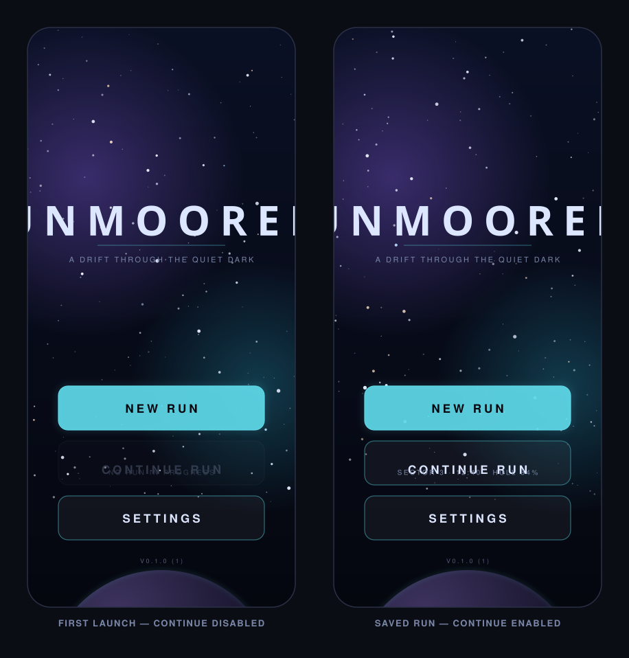

# Unmoored

A space-themed mobile game, built with Expo (React Native). This repository
currently contains the **start screen** and the scaffolding around it.



## Getting it running on Windows

You need [Node.js](https://nodejs.org) (LTS) and the **Expo Go** app from the
iPhone App Store. No Mac, no Xcode.

```powershell
npm install
npx expo install --fix
npx expo start
```

A QR code appears in the terminal. Open the **Camera** app on your iPhone, point
it at the code, and tap the banner — the game opens in Expo Go. Your phone and PC
need to be on the same WiFi network.

Edit any file and save: the screen reloads on your phone in about a second.

### If Expo Go says the SDK version doesn't match

Expo Go only runs the current SDK. Upgrade the project to match:

```powershell
npx expo install expo@latest --fix
```

That one command realigns every dependency, and is also the fix for any
"incompatible version" warning during install.

## What the start screen does

Three menu entries:

| Entry | Behaviour |
| --- | --- |
| **New Run** | Discards any saved run, writes a fresh one, and opens the run screen. |
| **Continue Run** | Enabled only when a save exists. Its caption shows that run's progress (`SECTOR 3 · 12:40 · HULL 84%`); with no save it reads `NO RUN IN PROGRESS` and is greyed out and untappable. |
| **Settings** | Slides up the settings sheet. |

Supporting details:

- **Parallax starfield** — three depth bands scrolling at different speeds, looping
  seamlessly, with a subset of stars twinkling out of phase. Animation runs on the
  UI thread via Reanimated, so it stays smooth.
- **Backdrop** — gradient sky, two nebula blooms, and a lit planet rising from the
  lower edge with an atmospheric rim.
- **Entrance animation** — the title fades in and the menu entries rise in sequence.
- **Touch feel** — press states with scale and bloom, drag-off cancels, and a light
  haptic on tap with a firmer one on activation.
- **Layout** — derived from the real screen size and safe-area insets, so it adapts
  across devices rather than assuming one screen.
- **Reduce Motion** — a settings toggle that stills the drift and the entrance.

## Project layout

```
app/                     Screens (expo-router: one file = one route)
  _layout.tsx            Navigation stack, providers, status bar
  index.tsx              The start screen
  run.tsx                Stand-in for gameplay (see below)
  settings.tsx           Settings sheet
components/
  StarField.tsx          Looping parallax star layers
  Backdrop.tsx           Sky gradient, nebulae, planet
  MenuButton.tsx         Menu entry with pressed and disabled states
  TitleBlock.tsx         Wordmark, rule and tagline
lib/
  theme.ts               Palette, type scale, layout constants
  runStore.ts            Saves and loads the current run
  settings.tsx           Player preferences + haptics helper
assets/
  icon.png               App icon (1024×1024)
```

There are no image assets beyond the icon — every gradient and glow is drawn with
SVG or native views, so the art scales to any screen.

## The placeholder run screen

`app/run.tsx` is **not gameplay**. It exists so the menu actions can be exercised
end to end: starting a run creates a save, time spent there accumulates, and
leaving writes it back so Continue Run has something real to resume. Replace it
when the actual game arrives — nothing else depends on its contents.

## Publishing to the App Store

All of this happens from Windows. Expo builds the iPhone app on their Macs.

```powershell
npm install -g eas-cli
eas login
eas build --platform ios      # produces a real .ipa
eas submit --platform ios     # uploads it to App Store Connect
```

You will need:

- An **Apple Developer Program** membership — $99/year, required by Apple to publish.
- An **Expo account** — the free tier includes a limited number of cloud builds per month.

Still placeholders before you ship:

- `bundleIdentifier` is `com.unmoored.game` in `app.json` — change it to something you own.
- The app icon is generated art, not a finished piece of design.
- App Store Connect will also want screenshots, a description and a privacy policy.

## History

The start screen was first built as a native Swift + SpriteKit app. That version
is preserved in git history at commit `bc42c4d` if it is ever useful — it was
replaced because building it requires a Mac.
