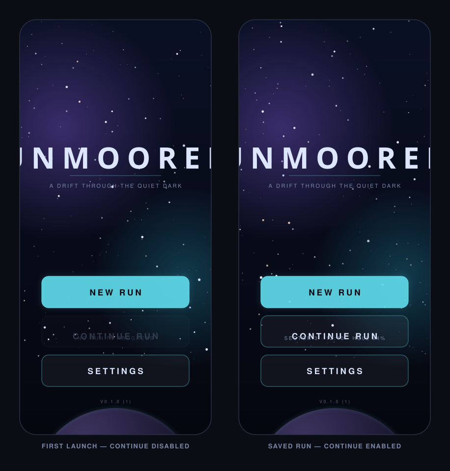

# Unmoored

A space roguelike for iPhone, built with Expo (React Native) and TypeScript.
It is pre-release: you pick a ship, cross a sector of stars one jump at a time,
talk to whoever is out there and fight the ones who want a fight.

`CLAUDE.md` is the detailed guide — how every part works, why it is built that
way, and the traps already paid for. This file is the short version.



## Playing it

The live build is published as a web page you can open in the browser:
<https://claude.ai/artifact/DUdeLS4PCiguJTRHJw2YuZ>. It is the real game,
compiled for the web — not a mock-up — and it is updated in place, so the same
link always has the newest version.

**Expo Go cannot open this project**, and upgrading to make it do so is not a
small step. Expo Go only runs the newest Expo release (SDK 57); this project is
on SDK 53, and moving up four releases would rewrite the animation library that
drives every moving thing in the game. Do not run `npx expo install expo@latest`
to chase it. When it is time to try the game on a phone, the route is a
development build (`eas build`), which runs this SDK as it is. The reasoning is
written out in `CLAUDE.md` under "Playing it on an actual phone".

## Checking it builds

```powershell
npm install
npm run verify       # typecheck, plus the star-map, reactor and combat checks
npm run build:web    # full production bundle — catches what the typecheck cannot
```

There is no test runner or linter; `npm run verify` is the automated safety net.
`.claude/skills/run-unmoored/` has the recipe for running and screenshotting the
game in a container.

## What is in it

- **Start screen** — NEW RUN, CONTINUE RUN (with the run's sector and fuel), and
  SETTINGS, over a planet, nebulae and a field of stars.
- **Ship select** — three ships in a swipeable carousel: the **Drifter** and the
  **Lance** from the start, and the **Bulwark**, which is locked (Settings →
  Dev Mode → Unlock All Ships opens it). Each launches with its own weapon, and
  differs in cargo space and reactor size.
- **Space screen** — your ship on its side, and whatever is waiting at this star
  facing it. Below: the hull (yellow at half, red at a quarter), the reactor
  panel (move bars of energy between shields, weapons and the Wren Drive with
  − and +), then AUTOFIRE, SHIP (the weapon, cargo and crew) and JUMP, with the
  fuel left on it.
- **Star select** — twenty stars on a chart. Stars in range are bright; the boss
  is the red one at the top, always six jumps away. A tank holds ten jumps.
- **Settings** — sound sliders (there is no sound in the game yet), haptics,
  Reduce Motion, Dev Mode and Reset Progress.

What is at a star is only learned by arriving. Every encounter speaks first —
the lines are in `lib/dialogue.ts`, the table to edit. Red ships fight: they
shoot back and hold your drive for longer. Yellow ones trade or talk, unless you
fire on them. The weapon and the jump drive charge over time, faster with more
energy in their row; the energy in the shields sets how many layers they can
build up to. Shields soak hits until they are down; then the hull loses
plates, and at zero it is Game Over.

Every ship — yours and theirs — has the same three systems, each marked where
it sits on the hull. Tap the weapon on your ship, then one of their systems,
to target it: the weapon fires at it as soon as it is charged. With
**AUTOFIRE** on it keeps firing on every full charge; nothing fires without a
target. Before each shot the shooter lines up with the exact system it is
aiming at. A hit that gets past the
shields takes a hull plate and a bar off the system it was aimed at, for the
rest of the run (a repair system is planned). Their systems show as thin bars
under their hull line.

Every ship has an engine on its tail that burns brighter the more bars are in
its **Wren Drive**, and goes dark with none. A powered ship bobs gently up and
down, and each shot waits a moment while the shooter lines up with the other
ship. Every Wren Drive bar makes shots at that ship 10% likelier to miss: on a
miss the bolt flies straight on, the ship dodges out of its way, and MISS pops
up over it.

## Project layout

```
app/                   The screens — one file each
  index.tsx            Start screen
  select-ship.tsx      Ship select
  run.tsx              Space screen (the code calls it the helm)
  sector.tsx           Star select (the code calls it the sector map)
  settings.tsx         Settings
  encounters.tsx       Dev Mode's encounter tester
components/            Everything drawn: panels, buttons, effects
  space/               The space screen's pieces: the ships, the controls, combat
  ships/               The ships, their shields and engines
lib/                   The rules, with no drawing in them
  run.ts               The rules of a run: jumping, energy, firing, hits
  runStore.ts          Saving and loading the run in progress
  sectorMap.ts         How each sector's stars are laid out
  dialogue.ts          Every encounter and what is said
  energy.ts            Reactor bars and how fast things charge
  ships.ts, weapons.ts The roster and what each ship carries
  portraits.ts         Generated from assets/portraits/ — do not edit by hand
scripts/               Property checks, the publishing step, portrait tools
assets/portraits/      The character portraits
```

## Publishing to the App Store

All of this happens from Windows. Expo builds the iPhone app on their Macs.

```powershell
npm install -g eas-cli
eas login
eas build --platform ios      # produces a real .ipa
eas submit --platform ios     # uploads it to App Store Connect
```

You will need:

- An **Apple Developer Program** membership — $99/year, required by Apple to publish.
- An **Expo account** — the free tier includes a limited number of cloud builds per month.

Still placeholders before you ship:

- `bundleIdentifier` is `com.unmoored.game` in `app.json` — change it to something you own.
- The app icon is generated art, not a finished piece of design.
- App Store Connect will also want screenshots, a description and a privacy policy.

## History

The start screen was first built as a native Swift + SpriteKit app, replaced
because building it requires a Mac. That version is no longer in this
repository's history — the history was restarted from a later snapshot.
